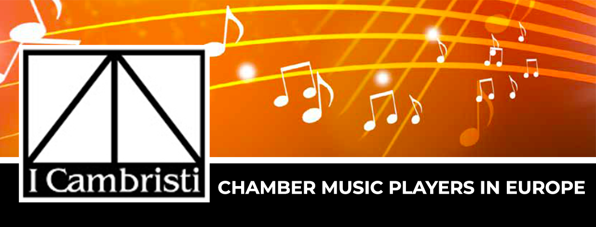

View this page [online](https://cloud.cambristi.com/news/2026xxxx.html)

<!-- Main top banner -->

---

# MAIN TITLE

---

☞[_English_](#_english_)

☞[_Nederlands_](#_nederlands_)

###### _French_

Ajouter du texte ici, par exemple :
- Un texte français
- Une autre ligne de texte
- avec des accents comme 'éléphant'

|  | <h1>Atelier Hastir</h1> |
|---------------------------------------------------|-------------------------|

## Rappel: Action de votre part, pour les membres de CAMBRISTI:

Plusieurs membres nous ont demandé de pouvoir connaître les préférences de style musical des autres membres, afin de
rechercher plus facilement des partenaires musicaux potentiels.

Pour cela, nous vous demandons de bien vouloir mettre à jour vos informations personnelles sur le site I CAMBRISTI en
cochant les cases de style musical qui sont les vôtres.

Cela ne vous prendra qu'une minute ou deux et sera précieux pour
toute la communauté.

Pour ce faire, cliquez sur le lien ci-dessous:
[mes informatons personnelles](https://www.cambristi.com/mes-informations-personnelles)

Les menus [Recherche de membres](https://www.cambristi.com/recherche-de-membres)
et les [Listes de membres](https://www.cambristi.com/member-list) contiendront dès lors cette information

###### _English_

## Reminder: Action required on your part, for all CAMBRISTI members:

Several members have asked us to be able to find out the musical style preferences of other members, in order to
make it easier to find potential musical partners.

To do this, we kindly ask you to update your personal information on the I CAMBRISTI website by
ticking the boxes corresponding to your musical style preferences.

It will only take a minute or two and will be invaluable to
the whole community.

To do this, click on the link below:
[My personnal information](https://www.cambristi.com/mes-informations-personnelles?lang=en)

The menus [Search for members](https://www.cambristi.com/recherche-de-membres?lang=en)
and [Member's lists](https://www.cambristi.com/member-list?lang=en) will afterward include this information

###### _Nederlands_

## Herinnering: Wat u moet doen, voor alle leden van CAMBRISTI:

Verschillende leden hebben ons gevraagd om de muzikale voorkeuren van andere leden te kennen, zodat ze
gemakkelijker potentiële muzikale partners kunnen vinden.

Daarom vragen wij u vriendelijk om uw persoonlijke gegevens op de website I CAMBRISTI bij te werken door
de vakjes aan te vinken die overeenkomen met uw muzieksmaak.

Dit kost u slechts een minuut of twee en is van onschatbare waarde voor
de hele gemeenschap.

Klik hiervoor op de onderstaande link:
[Mijn persoonlijke gegevens](https://www.cambristi.com/mes-informations-personnelles?lang=nl)

De menus [Zoek voor leden](https://www.cambristi.com/recherche-de-membres?lang=nl)
and [Lijst van leden](https://www.cambristi.com/member-list?lang=nl) zullen darna deze informatie bevatten.

  
---

---

_This mail was send by [I CAMBRISTI ASBL](https://www.cambristi.com/) to its members_

_If you don't want to receive future mails from this address, and cancel your membership, please click on the following link: [Unsubscribe](https://www.cambristi.com/cancel-membership)_